# Mapa de Dependências — SIFAP Legado

> **Trilha:** [Kit do Time](../README.md) › [Estágio 1](README.md) › **Mapa de Dependências**

**Artefato preenchido pelo time durante o Estágio 1 — Passo 3.** Registra as dependências entre programas Natural e DDMs Adabas que sustentam o escopo selecionado.

| Campo | Valor |
|---|---|
| **Público-alvo** | Todas as duplas, com liderança da Dupla 2 (Arquitetura) |
| **Pré-requisitos** | Catálogo de regras com as origens identificadas |
| **Estágio** | Estágio 1 — Arqueologia |
| **Resultado esperado** | Diagrama Mermaid e tabelas de arestas com evidência `arquivo:linha` |

> [!IMPORTANT]
> Mapeie apenas as dependências que explicam o escopo selecionado: programas `.NSN` que chamam outros programas (`CALLNAT`, `FETCH`) e programas que acessam DDMs (`READ`, `FIND`, `STORE`, `UPDATE`, `DELETE`). Toda aresta precisa estar apoiada em `arquivo:linha` — nenhuma inferência sem evidência. Este mapa alimenta as hipóteses de fatiamento em [`discovery-report.md`](discovery-report.md).

> [!NOTE]
> Guia passo a passo: [`GUIDE.md`](GUIDE.md).

**Time**: Equipe Nico
**Escopo**: biblioteca `legacy-sifap` completa — 15 programas com acesso a dados, 2 copycodes e os 4 DDMs. O mapa cobre toda a biblioteca porque o recorte de folha de pagamento (`BATCHPGT` → `BATCHREL` → `BATCHCON`) só é interpretável junto com os subprogramas e copycodes que ele compartilha com o cadastro.
**Fonte do diagrama**: [`dependency-map.mmd`](dependency-map.mmd)

---

## Diagrama Mermaid

```mermaid
%%{init: {'theme':'neutral','themeVariables':{'fontFamily':'ui-sans-serif, system-ui, sans-serif','primaryColor':'#F5F5F5','primaryTextColor':'#171717','primaryBorderColor':'#171717','lineColor':'#525252','secondaryColor':'#FFFFFF','tertiaryColor':'#FAFAFA','background':'#FFFFFF'}}}%%
flowchart TD
    classDef step fill:#F5F5F5,stroke:#171717,color:#171717
    classDef alt fill:#FFFFFF,stroke:#525252,color:#171717
    classDef muted fill:#FAFAFA,stroke:#A3A3A3,color:#404040
    classDef result fill:#FFFFFF,stroke:#171717,color:#171717,stroke-width:2px

    subgraph JOB["Batch — Control-M"]
        SIFAPJ01["SIFAPJ01 · STEP010"]
        SIFAPJ02["SIFAPJ02 · STEP010"]
    end

    subgraph BATCH["Batch (.NSP)"]
        BATCHPGT["BATCHPGT"]
        BATCHREL["BATCHREL"]
        BATCHCON["BATCHCON"]
    end

    subgraph ONLINE["Online (.NSP)"]
        CADBENEF["CADBENEF"]
        CADDEPEN["CADDEPEN"]
        CADPROG["CADPROG"]
        CONSBENF["CONSBENF"]
        VALDOCS["VALDOCS"]
        CALCCORR["CALCCORR"]
        CALCDSCT["CALCDSCT"]
        RELPGT["RELPGT"]
        RELAUDIT["RELAUDIT"]
    end

    subgraph SUB["Subprogramas (.NSN)"]
        SUBVALCP["SUBVALCP"]
        SUBVALNI["SUBVALNI"]
        VALBENEF["VALBENEF"]
        VALELEG["VALELEG"]
        CALCBENF["CALCBENF"]
    end

    subgraph CC["Copycodes (.NSC)"]
        CCAUDIT["CCAUDIT"]
        CCVALCPF["CCVALCPF"]
    end

    BENEFIC[("BENEFIC · 150")]
    SOCPROG[("SOCPROG · 151")]
    PAYMENT[("PAYMENT · 152")]
    AUDIT[("AUDIT · 153")]

    SIFAPJ01 --> BATCHPGT
    SIFAPJ02 --> BATCHREL

    BATCHPGT -->|CALLNAT| SUBVALCP
    BATCHPGT -->|CALLNAT| VALELEG
    BATCHPGT -->|CALLNAT| CALCBENF
    CADBENEF -->|CALLNAT| SUBVALCP
    CADBENEF -->|CALLNAT| SUBVALNI
    CADBENEF -->|CALLNAT| VALBENEF
    CALCCORR -->|CALLNAT| SUBVALCP
    CONSBENF -->|CALLNAT| SUBVALCP
    VALDOCS  -->|CALLNAT| SUBVALNI

    BATCHPGT -.->|INCLUDE| CCAUDIT
    BATCHCON -.->|INCLUDE| CCAUDIT
    CADBENEF -.->|INCLUDE| CCAUDIT
    CADDEPEN -.->|INCLUDE| CCAUDIT
    CADDEPEN -.->|INCLUDE| CCVALCPF
    CADPROG  -.->|INCLUDE| CCAUDIT
    CALCCORR -.->|INCLUDE| CCAUDIT
    CONSBENF -.->|INCLUDE| CCAUDIT
    SUBVALCP -.->|INCLUDE| CCVALCPF

    BATCHPGT -->|READ| BENEFIC
    BATCHPGT -->|"READ / FIND NUMBER / STORE"| PAYMENT
    BATCHPGT -->|FIND| SOCPROG
    BATCHREL -->|READ| PAYMENT
    BATCHREL -->|FIND| BENEFIC
    BATCHCON -->|"FIND / UPDATE"| PAYMENT
    BATCHCON -->|"READ / STORE"| AUDIT

    CADBENEF -->|"FIND / STORE / UPDATE"| BENEFIC
    CADDEPEN -->|"FIND / UPDATE"| BENEFIC
    CADPROG  -->|"FIND / STORE"| SOCPROG
    CONSBENF -->|FIND| BENEFIC
    CONSBENF -->|READ| PAYMENT
    CALCCORR -->|"READ / UPDATE"| PAYMENT
    CALCDSCT -->|"FIND / UPDATE"| PAYMENT
    CALCDSCT -->|FIND| BENEFIC
    RELPGT   -->|READ| PAYMENT
    RELPGT   -->|FIND| BENEFIC
    RELAUDIT -->|"READ / HISTOGRAM"| AUDIT

    CALCBENF -->|FIND| BENEFIC
    CALCBENF -->|FIND| SOCPROG
    CALCBENF -->|STORE| PAYMENT
    VALELEG  -->|FIND| BENEFIC
    VALELEG  -->|FIND| SOCPROG
    CCAUDIT  -->|"READ / STORE"| AUDIT

    class SIFAPJ01,SIFAPJ02 muted
    class BATCHPGT,BATCHREL,BATCHCON result
    class CADBENEF,CADDEPEN,CADPROG,CONSBENF,VALDOCS,CALCCORR,CALCDSCT,RELPGT,RELAUDIT step
    class SUBVALCP,SUBVALNI,VALBENEF,VALELEG,CALCBENF alt
    class CCAUDIT,CCVALCPF muted
    class BENEFIC,SOCPROG,PAYMENT,AUDIT result
```

> Linha cheia = `CALLNAT` ou acesso a dados. Linha tracejada = `INCLUDE` (expansão em tempo de compilação, não é chamada em tempo de execução). Cilindros = DDMs, com o número de arquivo Adabas.

---

## Arestas Programa → Programa

| # | De | Para | Tipo (`CALLNAT`/`FETCH`) | Evidência (`arquivo:linha`) |
|---|---|---|---|---|
| 1 | `BATCHPGT` | `SUBVALCP` | `CALLNAT` | `natural-programs/BATCHPGT.NSP:276` |
| 2 | `BATCHPGT` | `VALELEG` | `CALLNAT` | `natural-programs/BATCHPGT.NSP:369` |
| 3 | `BATCHPGT` | `CALCBENF` | `CALLNAT` | `natural-programs/BATCHPGT.NSP:381` |
| 4 | `BATCHPGT` | `CCAUDIT` | `INCLUDE` | `natural-programs/BATCHPGT.NSP:594` |
| 5 | `BATCHCON` | `CCAUDIT` | `INCLUDE` | `natural-programs/BATCHCON.NSP:345` |
| 6 | `CADBENEF` | `SUBVALCP` | `CALLNAT` | `natural-programs/CADBENEF.NSP:161` |
| 7 | `CADBENEF` | `SUBVALNI` | `CALLNAT` | `natural-programs/CADBENEF.NSP:196` |
| 8 | `CADBENEF` | `VALBENEF` | `CALLNAT` | `natural-programs/CADBENEF.NSP:263` |
| 9 | `CADBENEF` | `CCAUDIT` | `INCLUDE` | `natural-programs/CADBENEF.NSP:418` |
| 10 | `CADDEPEN` | `CCVALCPF` | `INCLUDE` | `natural-programs/CADDEPEN.NSP:230` |
| 11 | `CADDEPEN` | `CCAUDIT` | `INCLUDE` | `natural-programs/CADDEPEN.NSP:235` |
| 12 | `CADPROG` | `CCAUDIT` | `INCLUDE` | `natural-programs/CADPROG.NSP:176` |
| 13 | `CALCCORR` | `SUBVALCP` | `CALLNAT` | `natural-programs/CALCCORR.NSP:160` |
| 14 | `CALCCORR` | `CCAUDIT` | `INCLUDE` | `natural-programs/CALCCORR.NSP:243` |
| 15 | `CONSBENF` | `SUBVALCP` | `CALLNAT` | `natural-programs/CONSBENF.NSP:136` |
| 16 | `CONSBENF` | `CCAUDIT` | `INCLUDE` | `natural-programs/CONSBENF.NSP:314` |
| 17 | `SUBVALCP` | `CCVALCPF` | `INCLUDE` | `natural-programs/SUBVALCP.NSN:94` |
| 18 | `VALDOCS` | `SUBVALNI` | `CALLNAT` | `natural-programs/VALDOCS.NSP:109` |

### Arestas por área de dados compartilhada

Áreas de dados não são chamadas, mas acoplam programas com a mesma força: qualquer mudança de layout obriga recompilação de todos os consumidores.

| # | Área | Tipo | Consumidores | Evidência (`arquivo:linha`) |
|---|---|---|---|---|
| 19 | `LDASIFAP` | `LOCAL USING` | `BATCHCON`, `BATCHPGT`, `BATCHREL`, `CADDEPEN`, `CADPROG`, `CALCBENF`, `CALCCORR`, `CALCDSCT`, `CONSBENF`, `RELAUDIT`, `RELPGT`, `VALBENEF`, `VALELEG` | `natural-programs/BATCHPGT.NSP:30` · `BATCHREL.NSP:23` · `BATCHCON.NSP:21` · `CALCDSCT.NSP:13` |
| 20 | `PDAVALID` | `LOCAL` / `PARAMETER USING` | `BATCHPGT`, `CADBENEF`, `CALCCORR`, `CONSBENF`, `VALDOCS` · parâmetro em `SUBVALCP`, `SUBVALNI` | `natural-programs/BATCHPGT.NSP:28` · `SUBVALCP.NSN:29` · `SUBVALNI.NSN:39` |
| 21 | `PDACALC` | `LOCAL` / `PARAMETER USING` | `BATCHPGT` · parâmetro em `CALCBENF`, `VALELEG` | `natural-programs/BATCHPGT.NSP:29` · `CALCBENF.NSN:17` · `VALELEG.NSN:16` |

---

## Arestas Programa → DDM

Correspondência entre `VIEW` e DDM: `BENEFICIARY-V` → `BENEFIC` (arquivo 150), `PROGRAM-V` → `SOCPROG` (151), `PAYMENT-V` → `PAYMENT` (152), `AUDIT-V` → `AUDIT` (153). Todos no DBID 057.

| # | Programa | DDM | Operação | Evidência (`arquivo:linha`) |
|---|---|---|---|---|
| 1 | `BATCHPGT` | `PAYMENT` | `READ` (sequência `max+1`) | `natural-programs/BATCHPGT.NSP:240` |
| 2 | `BATCHPGT` | `BENEFIC` | `READ` | `natural-programs/BATCHPGT.NSP:250` |
| 3 | `BATCHPGT` | `PAYMENT` | `FIND NUMBER` (duplicidade no período) | `natural-programs/BATCHPGT.NSP:294` |
| 4 | `BATCHPGT` | `SOCPROG` | `FIND` | `natural-programs/BATCHPGT.NSP:302` |
| 5 | `BATCHPGT` | `PAYMENT` | `STORE` | `natural-programs/BATCHPGT.NSP:488` |
| 6 | `BATCHREL` | `PAYMENT` | `READ` | `natural-programs/BATCHREL.NSP:125` |
| 7 | `BATCHREL` | `BENEFIC` | `FIND` | `natural-programs/BATCHREL.NSP:142` |
| 8 | `BATCHCON` | `AUDIT` | `READ` (sequência) | `natural-programs/BATCHCON.NSP:116` |
| 9 | `BATCHCON` | `PAYMENT` | `FIND` | `natural-programs/BATCHCON.NSP:171` · `:206` · `:215` · `:222` |
| 10 | `BATCHCON` | `PAYMENT` | `UPDATE` | `natural-programs/BATCHCON.NSP:211` · `:218` · `:225` |
| 11 | `BATCHCON` | `AUDIT` | `STORE` | `natural-programs/BATCHCON.NSP:322` · `:341` |
| 12 | `CADBENEF` | `BENEFIC` | `FIND` | `natural-programs/CADBENEF.NSP:206` · `:306` |
| 13 | `CADBENEF` | `BENEFIC` | `STORE` | `natural-programs/CADBENEF.NSP:295` |
| 14 | `CADBENEF` | `BENEFIC` | `UPDATE` | `natural-programs/CADBENEF.NSP:318` |
| 15 | `CADDEPEN` | `BENEFIC` | `FIND` | `natural-programs/CADDEPEN.NSP:96` · `:175` · `:191` |
| 16 | `CADDEPEN` | `BENEFIC` | `UPDATE` | `natural-programs/CADDEPEN.NSP:203` |
| 17 | `CADPROG` | `SOCPROG` | `FIND` | `natural-programs/CADPROG.NSP:111` · `:158` |
| 18 | `CADPROG` | `SOCPROG` | `STORE` | `natural-programs/CADPROG.NSP:139` |
| 19 | `CALCBENF` | `BENEFIC` | `FIND` | `natural-programs/CALCBENF.NSN:166` |
| 20 | `CALCBENF` | `SOCPROG` | `FIND` | `natural-programs/CALCBENF.NSN:188` |
| 21 | `CALCBENF` | `PAYMENT` | `STORE` | `natural-programs/CALCBENF.NSN:319` |
| 22 | `CALCCORR` | `PAYMENT` | `READ` | `natural-programs/CALCCORR.NSP:174` |
| 23 | `CALCCORR` | `PAYMENT` | `UPDATE` | `natural-programs/CALCCORR.NSP:208` |
| 24 | `CALCDSCT` | `PAYMENT` | `FIND` | `natural-programs/CALCDSCT.NSP:79` · `:113` · `:184` |
| 25 | `CALCDSCT` | `BENEFIC` | `FIND` | `natural-programs/CALCDSCT.NSP:93` |
| 26 | `CALCDSCT` | `PAYMENT` | `UPDATE` | `natural-programs/CALCDSCT.NSP:186` |
| 27 | `CCAUDIT` | `AUDIT` | `READ` (sequência) | `natural-programs/CCAUDIT.NSC:66` |
| 28 | `CCAUDIT` | `AUDIT` | `STORE` | `natural-programs/CCAUDIT.NSC:98` |
| 29 | `CONSBENF` | `BENEFIC` | `FIND` | `natural-programs/CONSBENF.NSP:149` · `:157` |
| 30 | `CONSBENF` | `PAYMENT` | `READ` | `natural-programs/CONSBENF.NSP:271` |
| 31 | `RELAUDIT` | `AUDIT` | `READ` | `natural-programs/RELAUDIT.NSP:111` |
| 32 | `RELAUDIT` | `AUDIT` | `HISTOGRAM` (`DT-EVENT`) | `natural-programs/RELAUDIT.NSP:260` |
| 33 | `RELPGT` | `PAYMENT` | `READ` | `natural-programs/RELPGT.NSP:123` |
| 34 | `RELPGT` | `BENEFIC` | `FIND` | `natural-programs/RELPGT.NSP:154` |
| 35 | `VALELEG` | `BENEFIC` | `FIND` | `natural-programs/VALELEG.NSN:84` |
| 36 | `VALELEG` | `SOCPROG` | `FIND` | `natural-programs/VALELEG.NSN:100` |

### Arquivos sequenciais (fora do Adabas)

| # | Programa | Arquivo | Operação | Evidência (`arquivo:linha`) |
|---|---|---|---|---|
| 37 | `BATCHPGT` | `CMWKF01` — remessa bancária, LRECL 240 | `WRITE WORK FILE 1` | `natural-programs/BATCHPGT.NSP:502` · `SIFAPJ01.jcl` (DD `CMWKF01`) |
| 38 | `BATCHPGT` | `CMWKF02` — rejeitados, LRECL 120 | `WRITE WORK FILE 2` | `natural-programs/BATCHPGT.NSP` (rotina de rejeito) · `SIFAPJ01.jcl` (DD `CMWKF02`) |
| 39 | `BATCHCON` | `CMWKF01` — retorno bancário | `READ WORK FILE 1` | `natural-programs/BATCHCON.NSP:135` |

---

## Observações

- **Programas mais conectados (hubs):**
  - `CCAUDIT` — 7 `INCLUDE` de entrada (`BATCHPGT`, `BATCHCON`, `CADBENEF`, `CADDEPEN`, `CADPROG`, `CALCCORR`, `CONSBENF`). É o ponto único de gravação da trilha de auditoria e o primeiro candidato a virar um componente transversal em Java.
  - `SUBVALCP` — 4 `CALLNAT` de entrada (`BATCHPGT`, `CADBENEF`, `CALCCORR`, `CONSBENF`), além de incluir `CCVALCPF`. É a validação de CPF corporativa.
  - `PAYMENT` (arquivo 152) — acessado por 8 programas. É o agregado central do sistema: 611.902.774 registros e 257 GB no ADAREP de 14/03/2018, sem política de expurgo.
  - `BENEFIC` (arquivo 150) — acessado por 9 programas.
- **Programas isolados ou código morto:**
  - `CALCDSCT` **não tem chamador conhecido na biblioteca**. Nenhum `CALLNAT 'CALCDSCT'` existe, embora o cabeçalho de `BATCHPGT.NSP:17` afirme chamá-lo. Registrado como achado bônus em [`mysteries-found.md`](mysteries-found.md).
  - `VALBENEF.NSN:30` declara `VIEW OF BENEFIC` e nenhuma operação de leitura ou escrita usa essa view no corpo do subprograma.
  - `RELPGT` e `RELAUDIT` não chamam nem são chamados por nenhum programa: acoplam-se ao resto apenas por dados e pelo `LDASIFAP`.
  - `BATCHCON` não tem JCL na biblioteca. O cabeçalho em `natural-programs/BATCHCON.NSP:14` registra execução manual e pedido de agendamento dedicado (ticket 8110/2017).
  - Bloco de integração com o Banco Real permanece comentado em `BATCHCON.NSP` desde 2007, marcado como descontinuado.
- **Ordem de dependência do batch:**
  1. `SIFAPJ01` · STEP010 — `BATCHPGT` gera a folha e a remessa `CMWKF01`. Tabela Control-M `SIFAP-MENSAL`, grupo `SIFAP-PGT`, primeiro dia útil do mês às 22:00, janela de 4 horas, `PREDECESSOR NONE`, recurso `ADABAS-057` (`natural-programs/SIFAPJ01.jcl`).
  2. `SIFAPJ01` · STEP020 — `IEBGENER` copia a remessa para `SIFAP.TRANSM.REMESSA` se `RC ≤ 4`.
  3. `SIFAPJ01` · STEP030 — `IEFBR14` emite aviso de falha se `RC ≥ 5`.
  4. `SIFAPJ02` · STEP010 — `BATCHREL` produz o relatório consolidado. Sucessor condicionado a `RC=0` de `SIFAPJ01` (`natural-programs/SIFAPJ01.jcl`).
  5. `BATCHCON` — conciliação do retorno bancário, **sem agendamento**, executada manualmente após o recebimento do arquivo do banco.
- **Sentido único do fluxo de dados:** `BENEFIC` e `SOCPROG` são lidos pela folha e nunca escritos por ela; `PAYMENT` é escrito por `BATCHPGT`, `CALCBENF`, `CALCCORR`, `CALCDSCT` e `BATCHCON`. Cinco escritores no mesmo agregado, sem coordenação transacional entre eles.

---

## Definição de pronto

- [x] Toda aresta relevante ao escopo cita `arquivo:linha`.
- [x] Diagrama Mermaid gerado com o cabeçalho `%%{init:...}%%` e a paleta neutra.
- [x] Diagrama também disponível como arquivo autônomo em [`dependency-map.mmd`](dependency-map.mmd).

---

### Continue lendo

| Anterior | Próximo |
|---|---|
| [Catálogo de Regras](business-rules-catalog.md) Passo 2 — extração de regras. | [Questões em Aberto](mysteries-found.md) Passo 4 — registro de incertezas. |

[Voltar ao índice do kit](../README.md)
