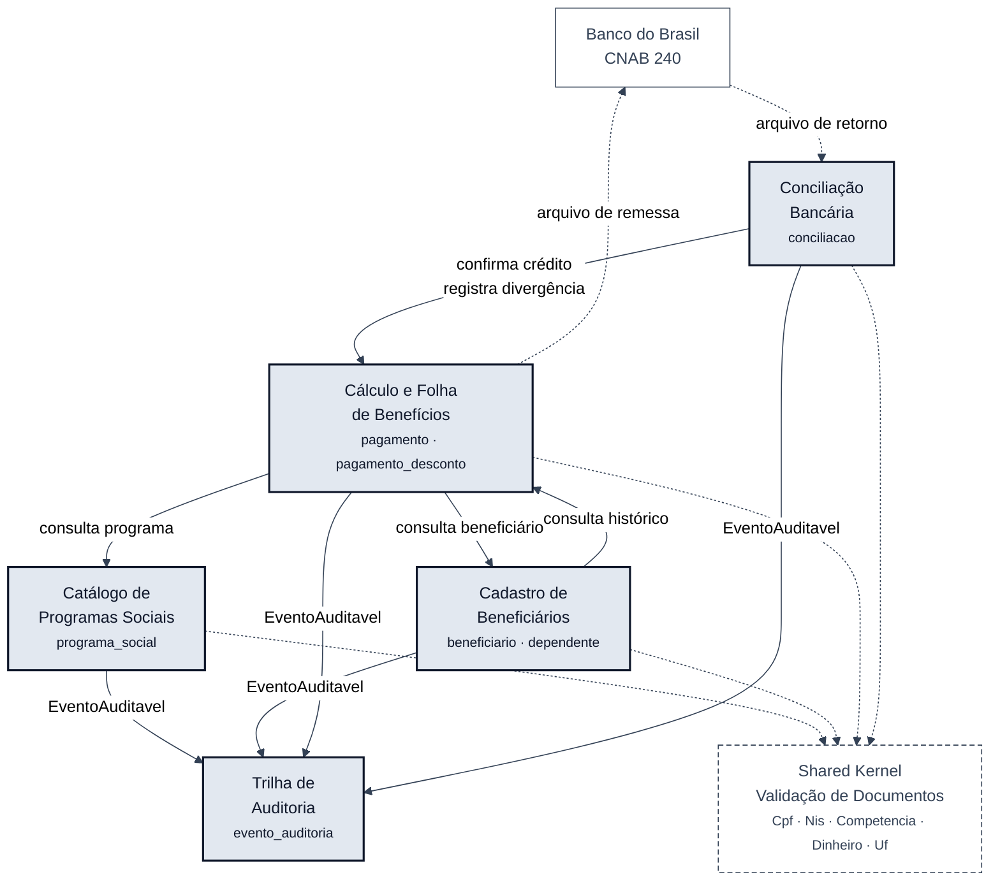

# Mapa de bounded contexts

> **Trilha:** [Kit do Time](../README.md) › [Estágio 2](README.md) › **Bounded Contexts**

**Entrada:** [`01-archaeology/discovery-report.md`](../01-archaeology/discovery-report.md) · [`dependency-map.md`](../01-archaeology/dependency-map.md) · [`business-rules-catalog.md`](../01-archaeology/business-rules-catalog.md) · [`mysteries-found.md`](../01-archaeology/mysteries-found.md)

> [!IMPORTANT]
> Status **aceito** em 2026-09-10. A equipe aceitou a recomendação integralmente; o registro está na seção [Decisão da equipe](#decisão-da-equipe). Na mesma data, `SIFAP-M-05` a `SIFAP-M-08` receberam validação humana, o que desbloqueou duas das cinco [Decisões que exigem ADR](#decisões-que-exigem-adr). As outras três seguem bloqueadas por achados bônus ainda abertos.

---

## Critérios de avaliação

| Critério | Como foi medido |
|---|---|
| **Coesão** | As regras do agrupamento representam uma única capacidade de negócio? Verificado contra as regras de [`business-rules-catalog.md`](../01-archaeology/business-rules-catalog.md) e contra os mistérios abertos. Um agrupamento que contém duas respostas para a mesma pergunta não é coeso. |
| **Acoplamento** | Número de arestas de [`dependency-map.md`](../01-archaeology/dependency-map.md) que cruzam o limite proposto. Arestas de **escrita** que cruzam pesam mais do que arestas de leitura. Áreas de dados compartilhadas (`LDASIFAP`, `PDAVALID`, `PDACALC`) contam como acoplamento. |
| **Frequência de mudança** | Aproximada pelas datas de `CHANGED` nos cabeçalhos e pelos tickets citados nos comentários. Programas alterados nas mesmas ondas provavelmente mudam juntos. |

Escala: **Alta / Média / Baixa**. Para coesão e frequência de mudança, *alta* é o valor desejável; para acoplamento, o desejável é *baixo*.

---

## Avaliação das hipóteses

### Hipótese 1 · Catálogo de Programas Sociais — ACEITA

| Critério | Avaliação | Evidência |
|---|---|---|
| Coesão | **Alta** | Uma única capacidade: manter o catálogo de programas de transferência de renda. `CADPROG` é o escritor exclusivo de `SOCPROG` (`CADPROG.NSP:139`). |
| Acoplamento | **Baixo** | Zero `CALLNAT` de saída. Cruzam o limite: 3 leituras de entrada (`BATCHPGT.NSP:302`, `CALCBENF.NSN:188`, `VALELEG.NSN:100`) e 1 `INCLUDE CCAUDIT` (`CADPROG.NSP:176`). Todas as entradas são somente leitura. |
| Frequência de mudança | **Baixa** | Nenhum ticket aberto incide sobre `CADPROG`. Não participa das ondas de 2004, 2011 nem 2016. |

**Placar: 3 de 3.** É a hipótese mais forte da lista e o candidato natural à primeira fatia do Strangler Fig — falhar aqui custa pouco.

### Hipótese 2 · Cadastro de Beneficiários — ACEITA COM AJUSTE

| Critério | Avaliação | Evidência |
|---|---|---|
| Coesão | **Alta** para o núcleo, **Baixa** para as bordas | Quem é o beneficiário e quais são seus dependentes é uma capacidade só. Mas `SUBVALCP`, `SUBVALNI` e `CCVALCPF` calculam dígito verificador de CPF e NIS — isso não é regra de beneficiário, é aritmética de documento brasileiro. |
| Acoplamento | **Médio** | 7 leituras de entrada em `BENEFIC` (aceitáveis, somente leitura) e **3 `CALLNAT` de entrada em `SUBVALCP`** vindos de fora do agrupamento: `BATCHPGT.NSP:276`, `CALCCORR.NSP:160`, `CONSBENF.NSP:136`. Somam-se 2 `INCLUDE CCAUDIT` de saída e o compartilhamento de `PDAVALID` com 3 programas externos. |
| Frequência de mudança | **Média** | Onda de 2011 concentrada: `SUBVALNI` criado, `CADBENEF.NSP:196` passa a chamá-lo, `VALDOCS.NSP:8` recebe validação de NIS, `PDAVALID.NSA:7` ganha o campo. Os membros mudaram juntos. |

**Ajuste proposto:** extrair `SUBVALCP`, `SUBVALNI` e `CCVALCPF` para um **Shared Kernel**. São funções puras sem DDM próprio, invocadas por três contextos distintos. Mantê-las dentro de Cadastro cria três dependências de contexto para calcular um dígito verificador.

### Hipótese 3 · Cálculo e Folha de Pagamento — ACEITA COM RESSALVA

| Critério | Avaliação | Evidência |
|---|---|---|
| Coesão | **Baixa** | O agrupamento contém **dois regimes de alíquota para a mesma pergunta**: 3% fixos em `BATCHPGT.NSP:458` e `CALCBENF.NSN:361`, contra a tabela progressiva de `LDASIFAP.NSL:62` usada por `CALCDSCT.NSP:198`. A duplicidade de cálculo entre `CALCBENF` e o inline de `BATCHPGT.NSP:479` foi arbitrada em 2026-09-10 (`SIFAP-M-06`), mas o conflito de alíquotas permanece — e o caminho declarado autoritativo é justamente o que carrega os 3% fixos. Um contexto com dois modelos concorrentes não é um contexto — é um limite ainda não traçado. |
| Acoplamento | **Alto** | 4 leituras de saída em `BENEFIC`, 3 em `SOCPROG`, 2 `CALLNAT` para o kernel de validação, 2 `INCLUDE CCAUDIT`. De entrada: 3 leituras de `PAYMENT` e **1 escrita de fora** — `BATCHCON.NSP:211` faz `UPDATE PAYMENT-V`. `LDASIFAP` e `PDACALC` atravessam todos os membros. |
| Frequência de mudança | **Alta** | É onde se concentram os tickets abertos: 4472/2004, 6621 e 6622/2011, 5510/2016, 3120. Muda com frequência e sem fechamento. |

**Ressalta-se:** aceita como **um** contexto, sem subdivisão interna neste momento. A fronteira entre "geração da folha" e "motor de descontos" só pode ser traçada depois que o conflito de alíquotas for validado por humano. Traçar agora significa congelar em código um dos dois regimes sem saber qual é o certo. **Não deve ser a primeira fatia do Strangler Fig.**

### Hipótese 4 · Conciliação Bancária — ACEITA

| Critério | Avaliação | Evidência |
|---|---|---|
| Coesão | **Alta** | Uma capacidade: casar o arquivo de retorno do banco com os pagamentos emitidos. Programa único, `BATCHCON`. |
| Acoplamento | **Médio** | Uma escrita cruzando o limite (`BATCHCON.NSP:211` · `:218` · `:225` atualizam `PAYMENT`) e 1 `INCLUDE CCAUDIT`. O acoplamento cai para baixo assim que a atualização passar por uma interface publicada pela Folha em vez de tocar a tabela. |
| Frequência de mudança | **Baixa** | Duas alterações em 20 anos: integração Banco Real em 2005, descontinuada em 2007; ajuste CNAB 240 em 2008 (`BATCHCON.NSP:7`). Muda quando o banco muda, não quando o benefício muda. |

**Placar: 2 de 3, com o terceiro resolvível por projeto.** É o único agrupamento com fronteira externa real — o Banco do Brasil. Separá-lo isola o risco de integração do risco de cálculo.

### Hipótese 5 · Relatórios, Consultas e Auditoria — REJEITADA COMO FORMULADA

| Critério | Avaliação | Evidência |
|---|---|---|
| Coesão | **Baixa** | Junta duas capacidades sem relação. (a) **Trilha de auditoria**: `CCAUDIT` escreve em `AUDIT` (`CCAUDIT.NSC:98`) e `RELAUDIT` lê (`RELAUDIT.NSP:111` · `:260`); obrigação da IN-TCU 63/2010 (`CADBENEF.NSP:38`). (b) **Relatórios e consultas de negócio**: `BATCHREL`, `RELPGT` e `CONSBENF` projetam `PAYMENT` e `BENEFIC`; obrigação da Lei 8.159 art. 14 (`BATCHREL.NSP:20`). Normas diferentes, donos diferentes, ciclos de vida diferentes. |
| Acoplamento | **Alto** na parte de auditoria, **Baixo** na de relatórios | `CCAUDIT` recebe **7 `INCLUDE` de entrada** vindos de todos os outros agrupamentos. Já `BATCHREL`, `RELPGT` e `RELAUDIT` não chamam nem são chamados por ninguém. |
| Frequência de mudança | **Baixa** nos dois lados | Nenhum ticket aberto incide sobre os programas de relatório. |

**Motivo da rejeição:** o agrupamento reúne o que é transversal a todos os contextos (auditoria) com o que é derivado de dois contextos específicos (relatórios). Rejeitar não é descartar — é **dividir**:

- **Aceito como contexto próprio:** `Trilha de Auditoria` (`CCAUDIT` + `RELAUDIT` + o arquivo `AUDIT`).
- **Redistribuído:** `BATCHREL` e `RELPGT` viram modelos de leitura dentro de **Folha de Benefícios**, cujos dados eles projetam; `CONSBENF` vira modelo de leitura em **Cadastro de Beneficiários**, compondo o histórico de pagamentos pela interface pública da Folha.

> [!NOTE]
> `BATCHREL` carrega um achado bônus que precisa viajar com ele: o relatório arredonda o bruto e soma desconto e líquido sem arredondar (`BATCHREL.NSP:166`–`:174`), de modo que BRUTO − DESCONTO ≠ LÍQUIDO na página impressa. Como modelo de leitura da Folha, isso vira uma decisão explícita de apresentação, não um cálculo escondido.

---

## Placar consolidado

| Hipótese | Coesão | Acoplamento | Freq. mudança | Veredito |
|---|---|---|---|---|
| 1 · Catálogo de Programas Sociais | Alta | Baixo | Baixa | ACEITA |
| 2 · Cadastro de Beneficiários | Alta (núcleo) | Médio | Média | ACEITA com extração do Shared Kernel |
| 3 · Cálculo e Folha de Pagamento | **Baixa** | **Alto** | **Alta** | ACEITA com ressalva, sem subdivisão interna |
| 4 · Conciliação Bancária | Alta | Médio | Baixa | ACEITA |
| 5 · Relatórios, Consultas e Auditoria | **Baixa** | Alto (auditoria) | Baixa | **REJEITADA** — dividida em contexto de auditoria + modelos de leitura |

---

## Bounded contexts finais

Cinco contextos e um Shared Kernel. O Shared Kernel **não é** um bounded context: não tem dados próprios nem regra de negócio, apenas tipos e funções puras compartilhadas.

### 1. Catálogo de Programas Sociais

| Campo | Valor |
|---|---|
| **Responsabilidade** | Manter o cadastro dos programas de transferência de renda: identificação, valor base, situação e vigência. |
| **Dados sob sua responsabilidade** | `SOCPROG` (arquivo 151) → tabela `programa_social` |
| **Interface pública** | `ProgramaSocialConsulta.porCodigo(CodigoPrograma): Optional<ProgramaSocial>` · `ProgramaSocialConsulta.ativosEm(Competencia): List<ProgramaSocial>` — somente leitura para fora. Escrita apenas por comandos internos do próprio módulo. |
| **Por que é um contexto próprio** | Escritor exclusivo dos seus dados, zero dependências de saída e a menor frequência de mudança da biblioteca. Legado correspondente: `CADPROG`. |

### 2. Cadastro de Beneficiários

| Campo | Valor |
|---|---|
| **Responsabilidade** | Identidade do beneficiário e de seus dependentes: dados cadastrais, documentos, situação e vínculo com programas. Responde "quem é" — nunca "quanto recebe". |
| **Dados sob sua responsabilidade** | `BENEFIC` (arquivo 150) → tabelas `beneficiario` e `dependente` |
| **Interface pública** | `BeneficiarioConsulta.porCpf(Cpf): Optional<Beneficiario>` · `BeneficiarioConsulta.ativosPorPrograma(CodigoPrograma): Stream<Beneficiario>` · `BeneficiarioCadastro.registrar(...)` / `.atualizar(...)` |
| **Por que é um contexto próprio** | Único escritor de `BENEFIC` (`CADBENEF.NSP:295` · `:318`, `CADDEPEN.NSP:203`) e as 7 arestas de entrada são todas de leitura, o que torna o limite defensável com uma interface de consulta. Legado: `CADBENEF`, `CADDEPEN`, `VALBENEF`, `VALDOCS`, mais `CONSBENF` como modelo de leitura. |

### 3. Cálculo e Folha de Benefícios

| Campo | Valor |
|---|---|
| **Responsabilidade** | Decidir elegibilidade, calcular o valor devido, aplicar descontos, gerar o pagamento da competência e produzir o arquivo de remessa bancária. É o núcleo do negócio. |
| **Dados sob sua responsabilidade** | `PAYMENT` (arquivo 152) → tabelas `pagamento` e `pagamento_desconto` (a segunda **com coluna de ordem**, porque o grupo periódico legado é ordenado e o cálculo depende disso) |
| **Interface pública** | `FolhaProcessamento.gerar(Competencia): ResultadoFolha` · `PagamentoConsulta.porBeneficiarioECompetencia(Cpf, Competencia)` · `PagamentoConciliacao.confirmarCredito(NumeroPagamento, DadosCredito)` · `PagamentoConciliacao.registrarDivergencia(NumeroPagamento, Divergencia)` |
| **Por que é um contexto próprio** | Concentra os cinco escritores de `PAYMENT` do legado. Com `SIFAP-M-06` arbitrado em favor do `CALCBENF`, o contexto passa a ter um algoritmo de referência único; manter os membros unidos é o que permite arbitrar o conflito de alíquotas em um lugar só, em vez de replicar a ambiguidade em dois módulos. Legado: `BATCHPGT`, `CALCBENF`, `VALELEG`, `CALCDSCT`, `CALCCORR`, mais `BATCHREL` e `RELPGT` como modelos de leitura. |

> [!WARNING]
> Este contexto ainda tem um conflito de alíquotas de contribuição não arbitrado, e ele piorou: ao fechar `SIFAP-M-06` em favor do `CALCBENF`, a equipe tornou autoritativa a sub-rotina `CALC-DISC` (`CALCBENF.NSN:358`–`:365`), que aplica 3% fixos e cujo próprio comentário remete a `CALCDSCT` como *full version*. Nenhum requisito EARS sobre cálculo deve ser escrito antes da validação humana desse ponto. Consulte [`mysteries-found.md`](../01-archaeology/mysteries-found.md).

### 4. Conciliação Bancária

| Campo | Valor |
|---|---|
| **Responsabilidade** | Traduzir o arquivo de retorno CNAB 240 do banco em fatos de negócio, casá-los com os pagamentos emitidos e registrar o estado da conciliação, inclusive as divergências. |
| **Dados sob sua responsabilidade** | Nova tabela `conciliacao` — **não existe no legado**. Os campos `DT-RECONCIL`, `STAT-RECONCIL`, `AMT-RECONCILED` e `DESCR-BANK-RETURN` estão declarados em `PAYMENT.ddm:94`–`:99` e a validação humana de 2026-09-10 confirmou que estão mortos (`SIFAP-M-08`): não migram como colunas. Também é dono do contrato dos arquivos de remessa e retorno. |
| **Interface pública** | `ConciliacaoProcessamento.processarRetorno(ArquivoRetorno): ResultadoConciliacao` · `ConciliacaoConsulta.porPagamento(NumeroPagamento)` |
| **Por que é um contexto próprio** | Único agrupamento com fronteira externa real e o único cujo ritmo de mudança é ditado por um terceiro (o banco). Isolá-lo impede que uma mudança de layout FEBRABAN atravesse o motor de cálculo. Legado: `BATCHCON`. |

> [!NOTE]
> `SIFAP-M-08` foi fechado em 2026-09-10: os quatro campos do grupo `BANK RECONCILIATION` estão mortos e não têm gravador dentro nem fora da biblioteca. A tabela `conciliacao` própria fica confirmada como destino do estado de conciliação, e a decisão 1 dos ADRs deixa de estar bloqueada.

### 5. Trilha de Auditoria

| Campo | Valor |
|---|---|
| **Responsabilidade** | Registrar de forma imutável quem alterou o quê e quando, e responder consultas de fiscalização sobre esse registro. Obrigação da IN-TCU 63/2010. |
| **Dados sob sua responsabilidade** | `AUDIT` (arquivo 153) → tabela `evento_auditoria`, somente inserção |
| **Interface pública** | Consome o evento de domínio `EventoAuditavel` publicado pelos demais contextos. Expõe `AuditoriaConsulta.porPeriodo(...)` e `AuditoriaConsulta.porEntidade(...)`. **Não expõe operação de escrita direta.** |
| **Por que é um contexto próprio** | No legado é o `INCLUDE CCAUDIT`, ou seja, o mesmo código copiado fisicamente em 7 programas — a definição de acoplamento acidental. Como contexto com assinatura por evento, os 7 acoplamentos viram 7 publicações e nenhuma dependência de compilação. Legado: `CCAUDIT` (escrita) e `RELAUDIT` (leitura). |

> [!NOTE]
> `CALCDSCT` é o único programa financeiro do legado sem `INCLUDE CCAUDIT`. No modelo moderno essa exceção deixa de existir: quem altera valor a pagar publica evento. Isso é uma **mudança de comportamento** e precisa de ADR.

### Shared Kernel · Validação de Documentos

| Campo | Valor |
|---|---|
| **Natureza** | **Não é um bounded context.** É um kernel compartilhado de tipos e funções puras, sem estado e sem dados próprios. |
| **Conteúdo** | Value objects `Cpf`, `Nis`, `Competencia` (`AAAAMM`), `Dinheiro` (`BigDecimal`, escala 2, nunca `double`) e `Uf`, com a validação de dígito verificador embutida na construção. |
| **Origem legada** | `SUBVALCP.NSN`, `SUBVALNI.NSN`, `CCVALCPF.NSC`, mais os tipos primitivos de `LDASIFAP.NSL` e `PDAVALID.NSA` |
| **Por que é kernel e não contexto** | Três contextos distintos o invocam (`BATCHPGT.NSP:276`, `CALCCORR.NSP:160`, `CONSBENF.NSP:136`) para calcular um dígito verificador. Não há regra de negócio do SIFAP aqui: o algoritmo do CPF é o mesmo no Brasil inteiro. |

> [!CAUTION]
> `LDASIFAP` é o kernel compartilhado do legado e **não deve ser migrado inteiro**. A tabela de fator regional (`LDASIFAP.NSL:35`), a tabela de UF por região (`:41`, contraditória com o próprio comentário) e as faixas de contribuição (`:62`) são regra de negócio da Folha, não tipos compartilhados. Levá-las para o kernel reproduziria em Java o acoplamento de 13 programas que existe hoje. A validação de `SIFAP-M-05` fixou a tabela de fator regional em **27** posições válidas: a guarda de 1 a 25 do legado é defeito e não deve ser reproduzida.

---

## Comunicação entre contextos

Toda comunicação é **em processo**, dentro da mesma JVM. Nenhuma chamada HTTP entre contextos.

| De | Para | Mecanismo | Dados trocados |
|---|---|---|---|
| Cálculo e Folha | Cadastro de Beneficiários | Chamada em processo via `BeneficiarioConsulta` | CPF, situação, data de nascimento, UF, vínculo com programa — substitui `BATCHPGT.NSP:250`, `CALCBENF.NSN:166`, `VALELEG.NSN:84` |
| Cálculo e Folha | Catálogo de Programas Sociais | Chamada em processo via `ProgramaSocialConsulta` | Código, valor base, situação e vigência do programa — substitui `BATCHPGT.NSP:302`, `CALCBENF.NSN:188`, `VALELEG.NSN:100` |
| Conciliação Bancária | Cálculo e Folha | Chamada em processo via `PagamentoConciliacao` | Número do pagamento, valor creditado, código de retorno do banco — **substitui o `UPDATE PAYMENT-V` direto de `BATCHCON.NSP:211`, que é a única escrita cruzando limite no legado** |
| Cadastro de Beneficiários | Cálculo e Folha | Chamada em processo via `PagamentoConsulta` | Histórico de pagamentos por CPF, para a tela de consulta herdada de `CONSBENF.NSP:271` |
| Todos os contextos | Trilha de Auditoria | **Evento de domínio** `EventoAuditavel` | Entidade, operação, identificador, usuário, timestamp — substitui os 7 `INCLUDE CCAUDIT` |
| Todos os contextos | Shared Kernel | Tipos compartilhados, sem chamada de módulo | `Cpf`, `Nis`, `Competencia`, `Dinheiro`, `Uf` |

**Regras de fronteira:**

1. Nenhum contexto lê ou escreve tabela de outro contexto. O legado tem 5 escritores em `PAYMENT`; o alvo tem 1.
2. Consultas entre contextos retornam DTOs do contexto chamador, nunca entidades JPA do contexto chamado. É a camada anticorrupção.
3. Auditoria é assíncrona por evento; nenhum contexto compila contra o módulo de auditoria.
4. O Shared Kernel não pode depender de nenhum contexto. Se um tipo precisar de regra de negócio do SIFAP, ele não pertence ao kernel.

---

## Diagrama do mapa de contextos

> Seta cheia = chamada em processo ou publicação de evento. Seta tracejada = dependência de tipos ou troca de arquivo com sistema externo. Caixa tracejada = Shared Kernel, que não é um bounded context.

---

## Ordem sugerida para o Strangler Fig

Derivada do placar, não de preferência:

1. **Catálogo de Programas Sociais** — placar 3 de 3, escritor único, nenhum mistério aberto. Prova a infraestrutura com risco mínimo.
2. **Trilha de Auditoria** — sem regra de negócio disputada; entregá-la cedo desbloqueia os eventos dos demais contextos.
3. **Cadastro de Beneficiários** — junto com o Shared Kernel de validação.
4. **Conciliação Bancária** — depende da interface publicada pela Folha. Desbloqueada: `SIFAP-M-08` foi fechado em 2026-09-10.
5. **Cálculo e Folha de Benefícios** — por último. Bloqueada pelo conflito de alíquotas de contribuição, ainda aberto.

---

## Decisão da equipe

| Campo | Valor |
|---|---|
| **Decisão** | **Aceita integralmente.** Os 5 bounded contexts e o Shared Kernel de validação ficam como recomendados, incluindo a rejeição da Hipótese 5 como formulada e seu desdobramento em Trilha de Auditoria + modelos de leitura. |
| **Alterações em relação à recomendação** | Nenhuma. |
| **Justificativa das alterações** | Não aplicável. |
| **Revisado por** | Equipe Nico |
| **Data** | 2026-09-10 |

> [!WARNING]
> O aceite vale para os **limites**, não para o conteúdo interno de cada contexto. O contexto **Cálculo e Folha de Benefícios** permanece sem subdivisão interna até que o conflito de alíquotas de contribuição seja validado com pessoa responsável do negócio, e continua sendo a **última** fatia do Strangler Fig.

### Decisões que exigem ADR

| # | Decisão | Bloqueada por |
|---|---|---|
| 1 | Onde vive o estado de conciliação: tabela própria ou colunas do pagamento | **Desbloqueada em 2026-09-10** — `SIFAP-M-08` fechado: os campos do DDM estão mortos, logo tabela própria |
| 2 | Qual cálculo é a fonte de verdade da folha | **Desbloqueada em 2026-09-10** — `SIFAP-M-06` fechado em favor do retorno de `CALCBENF` |
| 3 | Qual regime de contribuição social prevalece: 3% fixos ou tabela progressiva | Achado bônus aberto, `CALCBENF.NSN:361` × `LDASIFAP.NSL:62`. Prioridade 1 para o facilitador |
| 4 | Modelagem do grupo periódico de descontos: `@OneToMany` com coluna de ordem ou `JSONB` | Achado bônus aberto sobre dependência da ordem física |
| 5 | Publicar evento de auditoria também no cálculo de descontos, que hoje não audita | Mudança de comportamento em relação ao legado |

---

## Definição de pronto

- [x] Cada hipótese foi avaliada pelos três critérios.
- [x] Rejeições têm justificativa. **Hipótese 5 rejeitada como formulada, com o desdobramento registrado.**
- [x] Entre dois e cinco contextos foram definidos com nomes de negócio. **5 contextos + 1 Shared Kernel.**
- [x] Cada contexto tem responsabilidade, dados próprios e interface pública.
- [x] Um diagrama Mermaid mostra as relações e os caminhos de comunicação.
- [x] Decisão da equipe registrada. **Aceita integralmente em 2026-09-10.**

---

### Continue lendo

| Anterior | Próximo |
|---|---|
| [Relatório de Descoberta](../01-archaeology/discovery-report.md) Entrada do Estágio 2. | [Template de ADR](templates/ADR.template.md) Registrar as 5 decisões pendentes. |

[Voltar ao índice do kit](../README.md)
