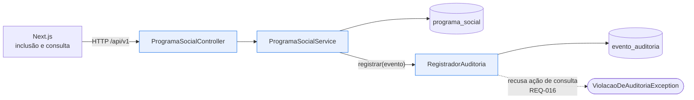

# Plano — 001-social-program-catalog

> **Trilha:** [Kit do Time](../../README.md) › [Especificações](../README.md) › [001 · Catálogo de Programas Sociais](spec.md) › **Plano**

**Menor estrutura de Monólito Modular que libera a primeira tarefa dos 17 requisitos de [`spec.md`](spec.md).**

| Campo | Valor |
|---|---|
| **Especificação** | [`spec.md`](spec.md) — 17 requisitos |
| **Contextos delimitados tocados** | Catálogo de Programas Sociais · Trilha de Auditoria |
| **ADRs vinculados** | [ADR-0003](../../docs/adr/0003-audit-trail-integrity-and-persistence.md) · [ADR-0004](../../docs/adr/0004-catalog-deliberate-divergences.md) |
| **Pacote-base** | `br.gov.sifap` |

---

## 1. Questão que este plano responde

**Qual é o menor recorte de módulos, dados e contratos que entrega inclusão e consulta de programa social com trilha de auditoria, sem antecipar os outros três contextos delimitados?**

A resposta tem duas partes: dois módulos com dados próprios e uma única direção de dependência entre eles. O Catálogo depende da Auditoria; a Auditoria não conhece o Catálogo.

---

## 2. Módulos (Monólito Modular)

| Módulo | Responsabilidade | Dados próprios (DDM → tabela) | Interface em processo | Atende ao REQ-ID |
|---|---|---|---|---|
| `catalogo` | Ciclo de vida do programa social: inclusão, consulta e as validações de entrada | `SOCPROG.ddm` → `programa_social` | `ProgramaSocialService` | REQ-001 a REQ-013 |
| `auditoria` | Registro imutável de eventos de auditoria e imposição da regra de não auditar consultas | `AUDIT.ddm` → `evento_auditoria` | `RegistradorAuditoria` | REQ-014 a REQ-017 |

### Estrutura de pacotes

```text
br.gov.sifap
├── catalogo
│   ├── domain          ProgramaSocial, CodigoPrograma, TipoPrograma, SituacaoPrograma, FaixaEtaria, Vigencia
│   ├── application     ProgramaSocialService, comandos e DTOs
│   └── infrastructure  ProgramaSocialRepository (JPA), ProgramaSocialController (REST)
└── auditoria
    ├── domain          EventoAuditoria, AcaoAuditoria, TipoEntidade
    ├── application     RegistradorAuditoria, ProvedorUsuarioResponsavel
    └── infrastructure  EventoAuditoriaRepository (JPA), UsuarioSistemaFixo
```

`domain` nunca importa `infrastructure`. `catalogo` importa apenas a interface `RegistradorAuditoria` de `auditoria.application`; nenhuma classe de `auditoria.domain` ou `auditoria.infrastructure` atravessa o limite. Um teste ArchUnit impõe as duas regras.

### Direção da dependência



A comunicação entre módulos é uma chamada de método em processo. Não há HTTP entre módulos, conforme a regra de Monólito Modular do kit.

---

## 3. Modelo de dados

Migração Flyway `V1__create_catalogo_e_auditoria.sql`.

### `programa_social`

| Coluna | Tipo | Restrição | Origem no DDM | REQ-ID |
|---|---|---|---|---|
| `codigo` | `VARCHAR(4)` | `PRIMARY KEY` | `SOCPROG.ddm:L28` (`A 4 U PRIMARY KEY`) | REQ-002 |
| `nome` | `VARCHAR(60)` | `NOT NULL` | `SOCPROG.ddm:L29` | REQ-001 |
| `tipo` | `CHAR(1)` | `NOT NULL`, `CHECK (tipo IN ('A','P','T'))` | `SOCPROG.ddm:L31-L32` | REQ-007 |
| `valor_base` | `NUMERIC(7,2)` | `NOT NULL`, `CHECK (valor_base BETWEEN 0 AND 99999.99)` | `SOCPROG.ddm:L41` (`P 7,2`) | REQ-005, REQ-006 |
| `fator_ajuste` | `NUMERIC(7,4)` | `NOT NULL DEFAULT 0` | `SOCPROG.ddm:L52` (`P 3,4`) | REQ-005 |
| `codigo_elegibilidade` | `VARCHAR(5)` | — | `SOCPROG.ddm:L65` | REQ-001 |
| `data_criacao` | `DATE` | `NOT NULL` | `SOCPROG.ddm:L35` | REQ-009 |
| `data_encerramento` | `DATE` | nulo significa vigência indeterminada | `SOCPROG.ddm:L36` (`0=ACTIVE`) | REQ-004, REQ-009 |
| `situacao` | `CHAR(1)` | `NOT NULL DEFAULT 'A'`, `CHECK (situacao IN ('A','I','E'))` | `SOCPROG.ddm:L37` | REQ-003 |
| `renda_percapita_maxima` | `NUMERIC(7,2)` | — | `SOCPROG.ddm:L56` | REQ-001 |
| `idade_minima` | `SMALLINT` | `NOT NULL DEFAULT 0` | `SOCPROG.ddm:L57` (`0=NONE`) | REQ-008 |
| `idade_maxima` | `SMALLINT` | `NOT NULL DEFAULT 0` | `SOCPROG.ddm:L58` (`0=NONE`) | REQ-008 |

Restrições de tabela:

- `CHECK (data_encerramento IS NULL OR data_encerramento >= data_criacao)` — REQ-009
- `CHECK (idade_minima = 0 OR idade_maxima = 0 OR idade_minima <= idade_maxima)` — REQ-008

A vigência indeterminada é representada por `NULL`, não por zero. O zero do legado é artefato de campo numérico sem nulo em Adabas; preservá-lo obrigaria toda consulta a conhecer a convenção.

### `evento_auditoria`

| Coluna | Tipo | Restrição | Origem no DDM | REQ-ID |
|---|---|---|---|---|
| `id` | `BIGINT` | `GENERATED ALWAYS AS IDENTITY PRIMARY KEY` | `AUDIT.ddm:L31` (`N 15 U UNIQUE SEQUENCE`) | REQ-014 |
| `data_evento` | `DATE` | `NOT NULL` | `AUDIT.ddm:L32` | REQ-014 |
| `hora_evento` | `TIME` | `NOT NULL` | `AUDIT.ddm:L33` | REQ-014 |
| `marca_temporal` | `TIMESTAMP` | `NOT NULL` | `AUDIT.ddm:L34` | REQ-014 |
| `codigo_acao` | `VARCHAR(2)` | `NOT NULL`, `CHECK (codigo_acao <> 'CO')` | `AUDIT.ddm:L39-L49` | REQ-014, REQ-016 |
| `modulo_origem` | `VARCHAR(8)` | `NOT NULL` | `AUDIT.ddm:L50` | REQ-014 |
| `descricao_acao` | `VARCHAR(80)` | `NOT NULL` | `AUDIT.ddm:L51` | REQ-014 |
| `tipo_entidade` | `VARCHAR(4)` | `NOT NULL` | `AUDIT.ddm:L55` | REQ-014, REQ-015 |
| `id_entidade` | `VARCHAR(15)` | `NOT NULL` | `AUDIT.ddm:L56` | REQ-015 |
| `cpf_afetado` | `VARCHAR(11)` | nulo quando não há titular | `AUDIT.ddm:L57` | REQ-015 |
| `usuario` | `VARCHAR(8)` | `NOT NULL`; nesta fatia sempre `SIFAPSYS` — ver P4 na seção 8 | `AUDIT.ddm:L69` | REQ-014 |
| `nome_job_batch` | `VARCHAR(16)` | preenchido apenas em ação de lote | `AUDIT.ddm:L83` | REQ-014 |
| `situacao_batch` | `CHAR(1)` | preenchido apenas em ação de lote | `AUDIT.ddm:L84` | REQ-014 |

Imutabilidade (REQ-014, cenário 2): trigger `BEFORE UPDATE OR DELETE ON evento_auditoria` que lança exceção. A regra vive no banco, não só na aplicação, porque a exigência legal de imutabilidade não pode depender de disciplina de código.

Índice: `idx_evento_auditoria_entidade (tipo_entidade, id_entidade, marca_temporal DESC)` — sustenta a consulta futura da trilha sem varredura.

As demais 22 colunas do DDM `AUDIT` **não** são criadas, conforme decisão 3 do [ADR-0003](../../docs/adr/0003-audit-trail-integrity-and-persistence.md).

---

## 4. Contrato REST

Base `/api/v1`. Erros no formato `application/problem+json`.

| Método e caminho | Requisitos | Respostas |
|---|---|---|
| `POST /api/v1/programas-sociais` | REQ-001 a REQ-009, REQ-015 | `201 Created` com `Location`; `400` para violação de REQ-002 e REQ-005 a REQ-009; `409` para código já existente; `500` para REQ-013 |
| `GET /api/v1/programas-sociais/{codigo}` | REQ-011, REQ-012, REQ-016 | `200` com os seis campos de REQ-011; `404` para REQ-012 |

Qualquer outro método sobre esses caminhos responde `405 Method Not Allowed`, que é a expressão de REQ-010 em protocolo HTTP: só existem inclusão e consulta.

O `409` não decorre de requisito. É a tradução da violação da chave primária, conforme a decisão 5 da seção 6 de [`spec.md`](spec.md): a verificação explícita de duplicidade ficou fora do escopo e a integridade é do banco.

A resposta de `GET` expõe **apenas** código, nome, tipo, valor base, código de elegibilidade e situação. Os demais campos persistidos não são devolvidos, conforme o cenário 2 de REQ-011.

---

## 5. Transacionalidade

| Operação | Propagação | Justificativa |
|---|---|---|
| `ProgramaSocialService.incluir` | `REQUIRED` | Unidade de trabalho do negócio; desfeita por completo em erro (REQ-013) |
| `RegistradorAuditoria.registrar` | `REQUIRES_NEW` | O evento sobrevive ao rollback do negócio (REQ-017), conforme decisão 2 do [ADR-0003](../../docs/adr/0003-audit-trail-integrity-and-persistence.md) |

Consequência a tratar na implementação: a descrição da ação precisa registrar o desfecho, não a intenção, porque um evento pode existir sem a operação correspondente. O cenário 2 de REQ-017 exige que a falha do registro de auditoria seja sinalizada sem impedir o desfecho definido em REQ-013.

---

## 6. Frontend

Next.js 15, App Router, Server Components por padrão.

| Rota | Requisitos | Notas |
|---|---|---|
| `/programas-sociais/novo` | REQ-001 a REQ-009 | Formulário com Server Action; validação espelhada no cliente para retorno imediato, autoritativa no servidor |
| `/programas-sociais/[codigo]` | REQ-011, REQ-012 | Server Component; `404` renderiza a mensagem de programa não encontrado |

A validação do cliente **não** substitui a do servidor. As mensagens de erro vêm do `problem+json` da API, para que interface e API não divirjam.

---

## 7. Estratégia de testes

| Camada | Ferramenta | Cobre |
|---|---|---|
| Unitário de domínio | JUnit 5 | REQ-002 a REQ-009: normalização do código, situação ativa, vigência, limite de valor, tipo, faixa etária, datas |
| Fatia web | `@WebMvcTest` | REQ-010, REQ-011, REQ-012: códigos de status e forma da resposta |
| Fatia de persistência | `@DataJpaTest` | Restrições de tabela e mapeamento |
| Integração | `@SpringBootTest` + Testcontainers PostgreSQL | REQ-013, REQ-014, REQ-015, REQ-016, REQ-017: rollback preservando o evento, imutabilidade por trigger, unicidade sob concorrência, recusa da ação de consulta |
| Arquitetura | ArchUnit | `domain` não importa `infrastructure`; `catalogo` só enxerga `auditoria.application` |
| Frontend | Vitest + Testing Library | Os dois fluxos de tela, incluindo o caminho de erro |

Cada teste referencia o REQ-ID em comentário inline, conforme a regra de rastreabilidade do repositório. Meta: backend ≥ 70%, frontend ≥ 60%, conforme a Definição de Pronto do handoff H3.

---

## 8. Questões de projeto em aberto

- **P1:** a notação `P 3,4` de `FACTOR-ADJUST` (`SOCPROG.ddm:L52`) foi mapeada para `NUMERIC(7,4)` por interpretação. Qual é a precisão real do campo no Adabas? — responsável: DBA Adabas, Roberto Carlos Ferreira; status: aberta
- **P2:** o legado grava data e hora em campos separados e ainda uma marca temporal derivada (`CCAUDIT.NSC:L75-L80`). Manter os três no alvo é redundância deliberada para compatibilidade de carga, ou basta a marca temporal? — responsável: Arquiteto de Software; status: aberta
- **P3:** o `HR-EVENT` legado perde o décimo de segundo (`CCAUDIT.NSC:L77`, `DIVIDE 10 INTO`). A carga histórica precisa preservar essa perda ou pode assumir precisão de segundo? — responsável: DBA; status: aberta
- **P4:** REQ-014 exige o usuário responsável, mas a fatia não tem autenticação especificada. De onde vem o usuário até existir controle de acesso? — **fechada em 2026-09-10**: usuário de sistema fixo `SIFAPSYS`, declarado provisório
- **P5:** a carga dos dados históricos do arquivo 151 exige decidir se o fator já embutido no valor base é revertido. Depende da questão aberta sobre o fator K. — responsável: SENARC; status: aberta, fora desta fatia

### P4 — decisão provisória acatada

O valor de `usuario` vem de `ProvedorUsuarioResponsavel`, uma interface de uma única operação cuja única implementação nesta fatia devolve a constante `SIFAPSYS` (8 posições, o mesmo tamanho de `COD-USER` em `AUDIT.ddm:L69`).

| Aspecto | Definição |
|---|---|
| Valor gravado | `SIFAPSYS` |
| Ponto de extensão | `ProvedorUsuarioResponsavel.obter()`, injetado em `RegistradorAuditoria` |
| Substituição futura | Trocar a implementação por uma que leia o princípio autenticado; nenhum outro ponto do código muda |
| Rastreio | O código da implementação fixa carrega um comentário marcando a natureza provisória e apontando para esta seção |

> [!WARNING]
> Isto desbloqueia código, não resolve o problema. Enquanto valer, **a trilha de auditoria não atribui responsabilidade a pessoa alguma** — todos os eventos têm o mesmo autor. Para a IN-TCU 63/2010, citada em `AUDIT.ddm:L13-L18`, uma trilha sem autor identificável não cumpre a finalidade. A fatia seguinte **não pode** ir para produção com `SIFAPSYS`; a decisão de autenticação passa a ser pré-requisito dela.

---

## 9. Fora deste plano

- Migração de dados do Adabas para o PostgreSQL.
- Autenticação, autorização e perfis de acesso.
- Consulta e relatório da trilha de auditoria — depende de `RELAUDIT.NSP`, ainda não submetido a extração formal.
- Os contextos Cadastro de Beneficiários, Cálculo e Folha e Conciliação Bancária.
- Infraestrutura de implantação, que é escopo do Estágio 4.

---

## Continue lendo

- [`spec.md`](spec.md) — os 17 requisitos e sua rastreabilidade
- [`tasks.md`](tasks.md) — decomposição em tarefas
- [ADR-0003](../../docs/adr/0003-audit-trail-integrity-and-persistence.md) — integridade e persistência da trilha
- [ADR-0004](../../docs/adr/0004-catalog-deliberate-divergences.md) — divergências deliberadas do Catálogo
